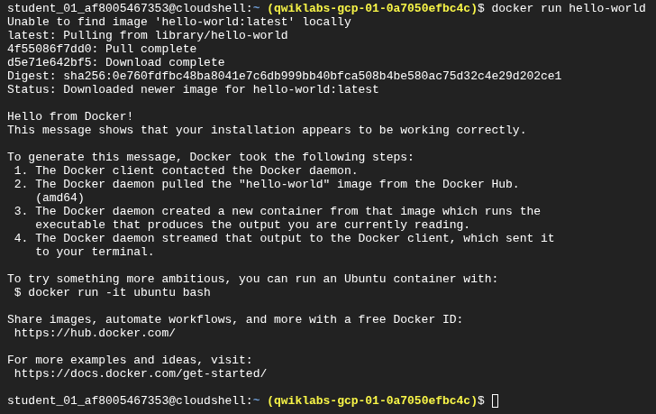

### **Task 1. Hello world**

1. Run a hello world container to get started:

```docker
docker run hello-world
```



This simple container returns `Hello from Docker!` to your screen. While the command is simple, notice in the output the number of steps it performed. The Docker daemon searched for the hello-world image, didn't find the image locally, pulled the image from a public registry called Docker Hub, created a container from that image, and ran the container for you.

1. Run the following command to take a look at the container image it pulled from Docker Hub:

```docker
docker images
```


This is the image pulled from the Docker Hub public registry. The Image ID is in SHA256 hash format—this field specifies the Docker image that's been provisioned. When the Docker daemon can't find an image locally, it will by default search the public registry for the image.

1. Run the container again:

```docker
docker run hello-world
```


Notice the second time you run this, the Docker daemon finds the image in your local registry and runs the container from that image. It doesn't have to pull the image from Docker Hub.

1. Finally, look at the running containers by running the following command:

```docker
docker ps
```


There are no running containers. You already exited the hello-world containers you previously ran.

1. In order to see all containers, including ones that have finished executing, run :

```docker
docker ps -a
```


This shows you the `Container ID`, a UUID generated by Docker to identify the container, and more metadata about the run. The container `Names` are also randomly generated but can be specified with `docker run --name [container-name] hello-world`.